# Cisco ISE 3.5 clustered service architecture

Date: 2026-08-31

Status: evidence-qualified architecture map for the three-node incident

This document shows how the major ISE service planes interact. It is not a
claim that every deployment enables every optional service. The affected
deployment has these combined personas:

- Node A: PPAN + PMnT + PSN.
- Node B: SPAN + SMnT + PSN.
- Node C: PSN.

The most important architectural fact is that ISE does **not** have one
universal cluster bus. JGroups, ISE Messaging/LDD, Ignite Data Grid, pxGrid,
and database synchronization are distinct mechanisms with different data,
failure domains, and ports.

Read the diagrams in order: request paths, cluster fabrics, runtime boundaries,
session distribution, and finally the incident overlay.

| Visual | Meaning |
|---|---|
| Blue | External system or client |
| Amber | Ingress, container, or authority |
| Green | Application service or worker |
| Purple | Durable store or distributed cache |
| Red | Inter-node transport/fabric or active fault |
| Gray dashed | Observer, deployment-dependent path, or unproven relationship |

## 1. Request and data-flow overview

Each horizontal lane answers one question. Repeated Oracle, Protocols Engine,
and Admin labels refer to the same node-local components redrawn to avoid
crossing lines.

```mermaid
%%{init: {"theme":"base","flowchart":{"curve":"basis","nodeSpacing":30,"rankSpacing":48},"themeVariables":{"fontFamily":"Inter,Segoe UI,Arial,sans-serif","fontSize":"15px","lineColor":"#64748b","clusterBkg":"#f8fafc","clusterBorder":"#cbd5e1"}}}%%
flowchart TB
    subgraph ADMIN[Admin and API request path]
        direction LR
        web[Admin users, DNA Center<br/>scanners and API clients] -->|HTTPS 443| kong[Kong / nginx]
        kong -->|/admin, /api, /ers| admin[Admin GUI and APIs<br/>jsvc worker pools]
        admin --> oracle1[(Local Oracle)]
        admin --> pool[IgniteClientPool]
        pool -->|TLS localhost:10800| ignite[(Local Ignite member)]
    end

    subgraph AAA[Authentication and identity path]
        direction LR
        nads[Switches, WLCs<br/>VPN and other NADs] -->|RADIUS / TACACS| policy[Protocols Engine]
        directories[AD / LDAP / MDM] <--> adagent[AD Agent / PBIS]
        adagent <--> policy
        policy --> oracle2[(Local Oracle)]
        adagent --> pbis[(PBIS local eventlog)]
    end

    subgraph SESSION[Session, monitoring and external context]
        direction LR
        policy2[Protocols Engine] --> ldd[(LDD / former LSD)]
        ldd <--> messaging[ISE Messaging]
        messaging --> mnt[(MnT Session Directory)]
        mnt -->|provider / topic data| pxgrid[pxGrid 2.0<br/>TCP 8910]
        pxgrid <--> partners[External pxGrid partners]
    end

    subgraph BACKGROUND[Background and migrated state]
        direction LR
        jobs[Reports, purges<br/>feeds and schedulers] --> admin2[Application services]
        admin2 --> oracle3[(Local Oracle)]
        oracle3 --- analytics[(Migrated Analytics<br/>entitlement / configuration)]
        analytics -. runtime consumer unknown .-> admin2
    end

    classDef external fill:#eaf2ff,stroke:#3b82f6,color:#0f172a,stroke-width:1.5px;
    classDef ingress fill:#fff4dc,stroke:#d97706,color:#0f172a,stroke-width:1.5px;
    classDef service fill:#eaf8f0,stroke:#16a34a,color:#0f172a,stroke-width:1.5px;
    classDef store fill:#f3edff,stroke:#7c3aed,color:#0f172a,stroke-width:1.5px;
    classDef unknown fill:#f1f5f9,stroke:#64748b,color:#334155,stroke-dasharray:5 4;
    class web,nads,directories,partners external;
    class kong,pxgrid,adagent ingress;
    class admin,policy,policy2,messaging,jobs,admin2,pool service;
    class oracle1,oracle2,oracle3,ignite,ldd,mnt,pbis store;
    class analytics unknown;
```

This diagram deliberately shows `localhost:10800` as a node-local connection.
The Application Server does not normally cross the network to another node's
thin-client listener. Ignite itself forms the distributed Data Grid over its
separate inter-node ports.

The backend port labels are implementation observations from the rooted
control and Patch 3 files. Public clients normally enter through the supported
service URL rather than addressing those backend ports directly.

## 2. Four independent cluster fabrics

The node roster is fixed; the fabrics are shown as separate horizontal lanes
so a fault in one is not visually mistaken for a fault in another.

| Node | Personas in the affected deployment |
|---|---|
| A | PPAN + PMnT + PSN |
| B | SPAN + SMnT + PSN |
| C | PSN |

```mermaid
%%{init: {"theme":"base","flowchart":{"curve":"basis","nodeSpacing":34,"rankSpacing":46},"themeVariables":{"fontFamily":"Inter,Segoe UI,Arial,sans-serif","fontSize":"15px","lineColor":"#64748b","clusterBkg":"#ffffff","clusterBorder":"#cbd5e1"}}}%%
flowchart TB
    subgraph CONFIG[1 · Durable configuration]
        direction LR
        ao[(A · PPAN Oracle<br/>authoritative writes)] --> jg[JGroups<br/>TCP 12001]
        jg --> bo[(B · local Oracle<br/>replicated copy)]
        jg --> co[(C · local Oracle<br/>replicated copy)]
        bo -. missing-event request .-> jg
        co -. missing-event request .-> jg
    end

    subgraph SESSION[2 · Limited session and endpoint-owner distribution]
        direction LR
        al[(A · LDD cache)] <--> msg[ISE Messaging<br/>TLS TCP 8671]
        msg <--> bl[(B · LDD cache)]
        msg <--> cl[(C · LDD cache)]
        mnt[(PMnT / SMnT<br/>fallback source)] -. connectivity-loss lookup .-> msg
    end

    subgraph GRID[3 · Persistent Data Grid]
        direction LR
        aclient[A · local Java client] -->|TLS localhost:10800| ai[(A · Ignite)]
        ai <--> dg[Discovery 47500<br/>communication 47100]
        dg <--> bi[(B · Ignite)]
        dg <--> ci[(C · Ignite)]
    end

    subgraph CONTEXT[4 · Operational context and external sharing]
        direction LR
        pmnt[(Primary MnT)] <-. MnT HA / synchronization .-> smnt[(Secondary MnT)]
        pmnt --> provider[Session Directory provider]
        smnt --> provider
        provider --> px[pxGrid controller / pubsub<br/>TCP 8910]
        px <--> clients[External pxGrid clients]
    end

    classDef source fill:#fff4dc,stroke:#d97706,color:#0f172a,stroke-width:1.5px;
    classDef store fill:#f3edff,stroke:#7c3aed,color:#0f172a,stroke-width:1.5px;
    classDef fabric fill:#ffe8e8,stroke:#dc2626,color:#0f172a,stroke-width:1.5px;
    classDef service fill:#eaf8f0,stroke:#16a34a,color:#0f172a,stroke-width:1.5px;
    classDef external fill:#eaf2ff,stroke:#3b82f6,color:#0f172a,stroke-width:1.5px;
    class ao,pmnt,smnt source;
    class bo,co,al,bl,cl,mnt,ai,bi,ci store;
    class jg,msg,dg fabric;
    class aclient,provider,px service;
    class clients external;
```

All three reported production nodes have 64 GiB RAM and are therefore expected
to be eligible Data Grid server members under the inspected Patch 3 logic. That
must still be confirmed from production service status and listeners.

## 3. Runtime and resource boundaries on one node

This view matters for the reported 1.5-GiB OOM: a process/container limit can
be exhausted while the 64-GiB VM remains healthy.

```mermaid
%%{init: {"theme":"base","flowchart":{"curve":"basis","nodeSpacing":34,"rankSpacing":48},"themeVariables":{"fontFamily":"Inter,Segoe UI,Arial,sans-serif","fontSize":"15px","lineColor":"#64748b","clusterBkg":"#f8fafc","clusterBorder":"#cbd5e1"}}}%%
flowchart TB
    subgraph ADMINRUNTIME[Admin and Data Grid runtime]
        direction LR
        client[HTTPS client] --> kong[Kong / nginx container<br/>profile memory limit]
        kong -->|local upstream| jvm[jsvc JVM<br/>Admin and API executors]
        jvm --> oracle[(Oracle process<br/>local durable state)]
        jvm --> pool[IgniteClientPool]
        pool -->|TLS localhost:10800| ignite[Ignite container<br/>separate memory limit]
        ignite --> disk[(/opt/ignite/data<br/>WAL and persistence)]
        analytics[(Analytics state<br/>persisted in configuration)] -. consumer unknown .-> jvm
    end

    subgraph POLICYRUNTIME[Policy, AD and messaging runtime]
        direction LR
        nad[Network device] --> policy[Protocols Engine]
        policy --> ad[AD Agent / PBIS]
        ad <--> dc[Active Directory]
        ad --> eventlog[(PBIS eventlog<br/>local socket / database)]
        policy --> messaging[ISE Messaging<br/>RabbitMQ queues]
    end

    classDef external fill:#eaf2ff,stroke:#3b82f6,color:#0f172a,stroke-width:1.5px;
    classDef container fill:#fff4dc,stroke:#d97706,color:#0f172a,stroke-width:1.5px;
    classDef service fill:#eaf8f0,stroke:#16a34a,color:#0f172a,stroke-width:1.5px;
    classDef store fill:#f3edff,stroke:#7c3aed,color:#0f172a,stroke-width:1.5px;
    classDef unknown fill:#f1f5f9,stroke:#64748b,color:#334155,stroke-dasharray:5 4;
    class client,nad,dc external;
    class kong,ignite container;
    class jvm,pool,policy,ad,messaging service;
    class oracle,disk,eventlog store;
    class analytics unknown;
```

The 1,536-MiB Kong limit and other profile-derived limits must be confirmed on
production. They are boundaries to measure, not assumed production facts.
Prometheus, Monit, and ISE alarms observe these runtimes; they are omitted from
the drawing so monitoring arrows do not obscure application flow.

## 4. Component reference

| Mechanism | Purpose | Scope and direction | Storage or state | Relevant ports |
|---|---|---|---|---|
| Local Oracle | Durable configuration, policy, deployment, identity-source and other application state on each node | PPAN accepts authoritative configuration changes; replicated copies are applied to other nodes | Local Oracle files/database on every node; it is not one shared VHDX/database | 1521 is an observed local/database listener; inter-node replication uses the mechanisms below |
| JGroups replication | Reliable transport for configuration and database change messages | Primarily PPAN to secondary nodes for incremental synchronization; receivers can request missed events | JGroups transports messages; it does not store the database | TCP 12001; HTTPS/SOAP 443 also participates in deployment operations |
| Full database sync | Rebuild a subscriber's configuration database after registration or loss of incremental consistency | PPAN exports/transfers a complete configuration snapshot to the target node | Database dump and rebuilt target-local Oracle state | Separate from ordinary JGroups incremental messages; exact transfer workflow is Cisco-controlled |
| ISE Messaging | Inter-node message queues/exchanges, including LDD and operational-log delivery | Full-mesh service relationships across ISE nodes | RabbitMQ-style queues with finite retained operational data | TLS TCP 8671; ISE internal communication TCP 15672 is also documented |
| LSD / LDD | Limited active-session and endpoint-owner lookup data used by PSNs, especially for CoA and ownership | Every PSN publishes/consumes limited records; not a full session or configuration database replica | Local RADIUS Session Directory and Endpoint Owner Directory caches; implementation logs identify `LSDRedisClient` | Uses ISE Messaging; profiler endpoint ownership synchronization TCP 6379 is separately documented |
| Ignite / Data Grid | Distributed, persistent cache and event/state service used by ISE applications | Eligible Data Grid members form a cluster; local Java clients normally enter through their own node | Replicated caches plus local Ignite persistence/WAL under `/opt/ignite/data` | 10800 client, 47500 discovery, 47100 inter-node communication |
| pxGrid 2.0 | Secure discovery, authentication, authorization, query, and publish/subscribe integration with external security products | External clients connect to configured pxGrid service nodes; ISE components such as MnT act as providers | Topic sequence/recovery state and data supplied by providers; it is not ISE configuration replication | TCP 8910 client and inter-node communication |
| MnT | Collection, storage, reporting, and Session Directory for operational data | PSNs/nodes send events toward PMnT/SMnT; MnT can provide session data to pxGrid and fallback data to LDD | Monitoring operational database, live/session data, reports | ISE Messaging/UDP paths depend on configuration; Data Connect is a separate reporting interface |
| Kong/API gateway | External HTTPS ingress and routing for GUI and API surfaces | Client-to-node, then node-local upstream to the appropriate Java service | Connection/worker state and logs; not a cluster database | Public 443; rooted/Patch 3 evidence maps local upstreams such as 9443, 9060, and 9070 |

## 5. Two similarly named session systems

`LSD/LDD RADIUS Session Directory` and `pxGrid Session Directory` are related
to session context but are not the same service:

```mermaid
%%{init: {"theme":"base","flowchart":{"curve":"basis","nodeSpacing":30,"rankSpacing":44},"themeVariables":{"fontFamily":"Inter,Segoe UI,Arial,sans-serif","fontSize":"15px","lineColor":"#64748b","clusterBkg":"#ffffff","clusterBorder":"#cbd5e1"}}}%%
flowchart LR
    auth[Successful authentication on a PSN] --> local[PSN local session cache]
    local --> limited[LDD/LSD limited record<br/>owner, MAC/IP, PSN, state]
    limited <-->|ISE Messaging full mesh| peers[Other PSNs' local LDD caches]
    peers --> coa[Fast local owner lookup for CoA]

    auth --> event[Accounting and operational events]
    event --> mnt[MnT Session Directory<br/>richer deployment session view]
    mnt --> provider[ISE pxGrid Session Directory provider]
    provider -->|batched topic<br/>/topic/com.cisco.ise.session| subscriber[External pxGrid subscribers]

    peers -. connectivity-loss fallback .-> mnt

    classDef external fill:#eaf2ff,stroke:#3b82f6,color:#0f172a,stroke-width:1.5px;
    classDef service fill:#eaf8f0,stroke:#16a34a,color:#0f172a,stroke-width:1.5px;
    classDef store fill:#f3edff,stroke:#7c3aed,color:#0f172a,stroke-width:1.5px;
    classDef ingress fill:#fff4dc,stroke:#d97706,color:#0f172a,stroke-width:1.5px;
    class auth,local,event,provider service;
    class limited,peers,mnt store;
    class coa ingress;
    class subscriber external;
```

- LDD exists so a PSN can find limited session/owner information locally
  without repeatedly calling MnT.
- MnT holds the richer operational session view and publishes Session Directory
  data to external pxGrid subscribers.
- A failure in one path does not automatically prove a failure in the other,
  although ISE Messaging, node connectivity, and shared application load can
  create common-cause failures.

## 6. Incident path overlaid on the architecture

The verified Patch 3 retry path implicated by the production logs is narrower
than the complete architecture:

```mermaid
%%{init: {"theme":"base","flowchart":{"curve":"basis","nodeSpacing":30,"rankSpacing":44},"themeVariables":{"fontFamily":"Inter,Segoe UI,Arial,sans-serif","fontSize":"15px","lineColor":"#64748b"}}}%%
flowchart LR
    request[GUI request] --> kong[Kong worker]
    kong --> thread[admin-http-pool worker]
    thread --> handler[Admin handler]
    handler --> pool[IgniteClientPool<br/>class-wide synchronized construction]
    pool -->|TLS localhost:10800| grid[Local Ignite/Data Grid listener]
    grid -->|normal| cache[distributed cached state]
    grid -. absent/refused .-> retry[10 wrapper attempts<br/>about 27 seconds for immediate refusals]
    retry --> pool
    pool -. retains request work .-> thread
    thread -. many concurrent waits .-> alert[Admin thread-pool threshold]
    alert -. upstream backlog/retry .-> kong
    kong -. worker/memory pressure .-> oom[possible Kong cgroup OOM]

    classDef external fill:#eaf2ff,stroke:#3b82f6,color:#0f172a,stroke-width:1.5px;
    classDef ingress fill:#fff4dc,stroke:#d97706,color:#0f172a,stroke-width:1.5px;
    classDef service fill:#eaf8f0,stroke:#16a34a,color:#0f172a,stroke-width:1.5px;
    classDef normal fill:#f3edff,stroke:#7c3aed,color:#0f172a,stroke-width:1.5px;
    classDef fault fill:#ffe8e8,stroke:#dc2626,color:#0f172a,stroke-width:1.5px;
    class request external;
    class kong ingress;
    class thread,handler,pool service;
    class grid,cache normal;
    class retry,alert,oom fault;
```

This explains a plausible amplification mechanism; it does not yet establish
whether local Data Grid failure, inter-node topology loss, traffic, OOM, or
another shared dependency is the first production fault.

## 7. Evidence status

### Verified or documented

- Cisco documents JGroups on TCP 12001 for configuration/data synchronization
  and explicitly states that JGroups transports replication messages rather
  than storing the replicated data.
- Cisco documents LDD as the newer name for LSD. It contains the RADIUS Session
  Directory and Endpoint Owner Directory and uses ISE Messaging for inter-node
  communication.
- Cisco documents Data Grid ports 10800, 47100, and 47500 as separate from
  JGroups and ISE Messaging.
- Patch 3 files identify Apache Ignite 2.16, local TLS client connections to
  `localhost:10800`, Oracle-backed address discovery, replicated caches, and
  local persistence/WAL.
- Cisco documents pxGrid 2.0 REST/WebSocket service on 8910. MnT batches Session
  Directory notifications for external subscribers.
- Rooted control and Patch 3 evidence map Kong to the node-local Java GUI/API
  services and identify `admin-http-pool` as the Admin connector executor.

### Deployment-dependent or still unproven

- Which production nodes have pxGrid service assigned and which is active.
- The exact production profile-derived Java, Kong, and Data Grid limits.
- Which specific caches and application operations in the affected production
  workload touch Data Grid at incident onset.
- Whether the production failure begins in Ignite, ISE Messaging/LDD, Oracle,
  Kong, external demand, or an infrastructure transient.
- The exact mechanism used for every MnT replication/failover flow. It is shown
  at the service level rather than mislabeled as JGroups, Ignite, or pxGrid.

## 8. Deliberately outside the overview

The main diagrams omit lower-level or optional services whose arrows would
obscure the incident paths. They remain relevant when their evidence appears:

- Admin, Data Grid, ISE Messaging, and pxGrid certificate chains plus DNS/NTP
  trust dependencies.
- Profiler/MFC, Redis implementation detail, indexing/Elasticsearch, CA/EST,
  posture, passive identity, TrustSec/SXP, licensing, and native IPsec.
- Load balancers/VIPs and the production-specific assignment of pxGrid or
  optional services to nodes.
- Exact full-database-sync, MnT failover, and monitoring-database replication
  internals that Cisco controls and the current evidence does not resolve.

These should be added as focused diagrams only when they become an active
hypothesis; they should not be folded back into the overview.

## Sources

- [Cisco: Understand and Troubleshoot ISE Replications](https://www.cisco.com/c/en/us/support/docs/security/identity-services-engine/226120-understand-and-troubleshoot-ise.html)
- [Cisco ISE 3.5 deployment guide: Light Data Distribution](https://www.cisco.com/c/en/us/td/docs/security/ise/3-5/admin_guide/b_ise_admin_3_5/b_ISE_admin_deployment.html)
- [Cisco ISE 3.5 ports used by all nodes](https://www.cisco.com/c/en/us/td/docs/security/ise/3-5/install_guide/b_ise_Installation_Guide_35/g_cisco_sns-3400_series_appliance_ports_reference-1/r_cisco_ise_all_nodes_ports.html)
- [Cisco ISE 3.5 pxGrid guide](https://www.cisco.com/c/en/us/td/docs/security/ise/3-5/admin_guide/b_ise_admin_3_5/b_ISE_admin_pxgrid.html)
- [Cisco pxGrid technical overview](https://developer.cisco.com/docs/pxgrid/technical-overview/)
- [Cisco: Troubleshoot ISE Session Management and Posture](https://www.cisco.com/c/en/us/support/docs/security/identity-services-engine/215419-ise-session-management-and-posture.html)
- [`component-fault-model.md`](component-fault-model.md) for rooted/Patch 3 implementation evidence and the incident-specific fault model.
